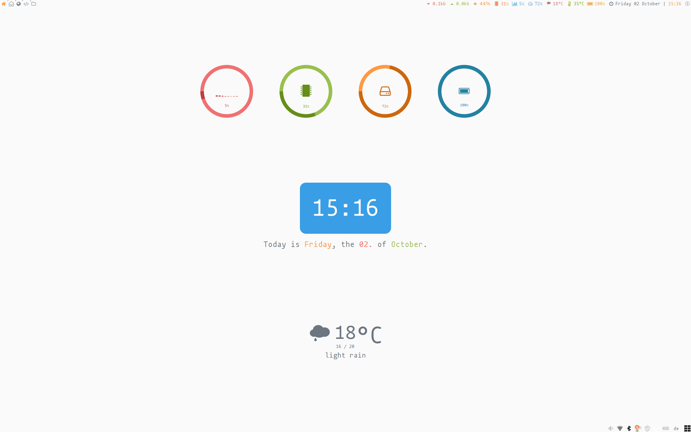

This configuration has initially been inspired by [Awesome WM Copycats][awesome-copycats].
The used [awesome-ayu][ayu] theme uses the gorgeous [ayu color palette][ayu-colors].

<!-- MarkdownTOC autolink="true" -->

- [Installation](#installation)
    - [Dependencies](#dependencies)
    - [Quick installation example](#quick-installation-example)
- [Configuration](#configuration)
- [License](#license)

<!-- /MarkdownTOC -->


# Installation

## Dependencies

 * [awesome v4.3][awesome]
 * [vicious][vicious]
 * [owfont - symbol font for Open Weather Map API][owfont]
 * [Font Awesome 4][font-awesome4]
 * [mononoki][mononoki]

optional to switch colorschemes

 * [wpgtk][wpgtk]

## Quick installation example

 1. Backup your current awesome configuration
    ```shell
    mv $HOME/.config/awesome $HOME/.config/awesome_$(date -I)
    ```

 2. Clone my configuration to `~/.config/awesome/`
    ```shell
    git clone --recursive https://github.com/MArpogaus/awesome-rc.git $HOME/.config/awesome 
    ```

 1. Install [Font Awesome 4][font-awesome4] and [mononoki][mononoki]
    ```shell
    # Debian / Ubuntu
    apt install fonts-font-awesome fonts-mononoki
    # Manjaro
    pamac build ttf-font-awesome-4 ttf-mononoki
    ```
 
 1. Download and install [owfont][owfont]
    ```shell
    wget -O /usr/share/fonts/TTF/owfont-regular.ttf 'https://github.com/websygen/owfont/blob/master/fonts/owfont-regular.ttf?raw=true'
    ```

 1. Create your configuration file.
    ```shell
    cd $HOME/.config/awesome 
    cp config.lua.tmpl config.lua
    ```

 1. **Optional:** install [wpgtk][wpgtk] to switch colorschemes.
    Details can be found in the [README of awesome-ayu][readme-of-awesome-ayu].

# Configuration

The configuration file `config.lua` is used to set default applications, modkeys and adjust the appearance of the theme to your needs.
The following table gives an overview of all configuration parameters required by `rc.lua`:

| Name           | Description                                        | Type   |
|:---------------|:---------------------------------------------------|:-------|
| `browser'      | command to run the web browser                     | string |
| `filemanager'  | command to run the file manger                     | string |
| `gui_editor'   | command to run the gui editor                      | string |
| `terminal'     | command to run the terminal emulator               | string |
| `lock_command' | command to lock the current session                | string |
| `modkey'       | the mod key to use for key bindings                | string |
| `altkey'       | the alt key to use for key bindings                | string |
| `theme'        | theme to load (only [`ayu`][ayu] supported so far) | string |

The following defaults are used as a fallback for any missing value:

```lua
{
    -- This is used later as the default terminal, editor etc.
    browser = 'exo-open --launch WebBrowser' or 'firefox',
    filemanager = 'exo-open --launch FileManager' or 'thunar',
    gui_editor = 'subl',
    terminal = os.getenv('TERMINAL') or 'lxterminal',
    lock_command = 'light-locker-command -l',

    -- Default modkey.
    modkey = 'Mod4',
    altkey = 'Mod1',

    -- Select theme
    theme = 'ayu'

}
```

Additionally the used [awesome-ayu][ayu] theme has the following configuration parameters:

| Name              | Description                             | Type             |
|:------------------|:----------------------------------------|:-----------------|
| `tyrannical`      | using Tyrannical tag managment engine   | bool             |
| `xresources`      | load colorschemes from xresources       | bool             |
| `color_scheme`    | colorscheme to use                      | string           |
| `dpi`             | number of pixels per inch of the screen | string           |
| `icon_theme`      | icon theme to use                       | string           |
| `wallpaper`       | path to your wallpaper                  | string           |
| `desktop_widgets` | enable/disable desktop widget           | bool             |
| `wibar_widgets`   | widgets for the wibar                   | array of strings |
| `arc_widgets`     | widgets for the the desktop pop up      | array of strings |
| `widgets_arg`     | widget parameters (see below)           | table            |

Please refer to the [README of awesome-ayu][readme-of-awesome-ayu] for details.

# License

licensed under MIT License Copyright (c) 2020 Marcel Arpogaus. See [LICENSE](LICENSE) for further details.

[awesome-copycats]: https://github.com/lcpz/awesome-copycats
[ayu]: https://github.com/MArpogaus/awesome-ayu
[ayu-colors]: https://github.com/ayu-theme/ayu-colors
[awesome]: https://awesomewm.org/
[vicious]: https://github.com/vicious-widgets/vicious
[owfont]: http://websygen.github.io/owfont/
[font-awesome4]: https://github.com/FortAwesome/Font-Awesome
[mononoki]: https://madmalik.github.io/mononoki/
[wpgtk]: https://github.com/deviantfero/wpgtk
[json-colorschemes]: https://github.com/deviantfero/wpgtk/wiki/Colorschemes#import-a-colorscheme
[readme-of-awesome-ayu]: https://github.com/MArpogaus/awesome-ayu/blob/master/README.md
[wpk-templates]: https://github.com/deviantfero/wpgtk-templates
[xsettingsd]: https://wiki.archlinux.org/index.php/Xsettingsd
